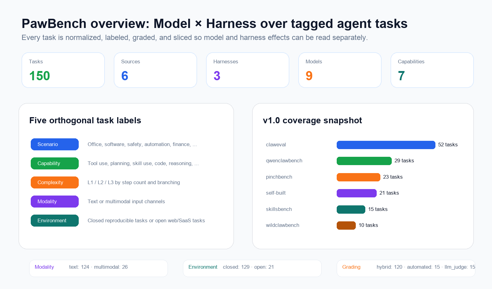
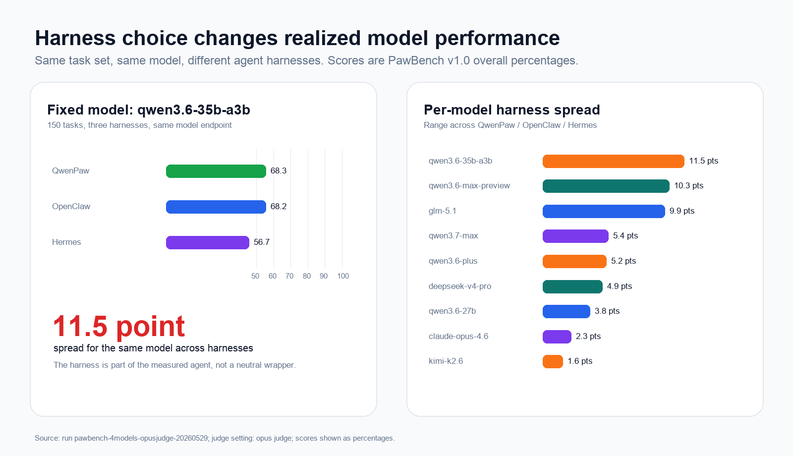
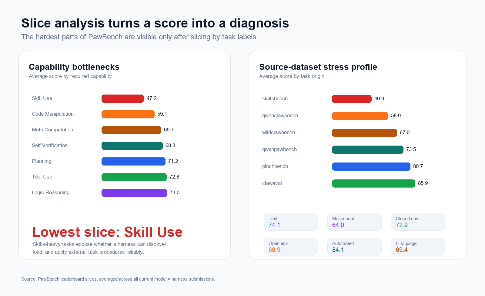

<h1 align="center">🐾 PawBench</h1>

<p align="center">
  <a href="README.md">English</a> ·
  <a href="README.zh-CN.md"><strong>简体中文</strong></a>
</p>

<p align="center">
  <a href="#任务构建">
    
  </a>
  <a href="https://agentscope-ai.github.io/PawBench/">
    
  </a>
  <a href="#harness">
    
  </a>
  <a href="https://agentscope-ai.github.io/PawBench/">
    
  </a>
  <a href="https://github.com/agentscope-ai/OpenJudge">
    
  </a>
  <a href="LICENSE">
    
  </a>
</p>

<p align="center">
  <strong>面向通用智能体的 Model × Harness 交叉评测基准。</strong><br>
  150 道智能体任务 · 9 款模型 · 3 个 Harness · 任务切片 · 诊断轨迹
</p>

---

同一个模型，放进不同的智能体运行框架里，实际表现可能会明显变化。一次任务失败，到底是模型没想明白，还是工具没给对、Skill 没发现、工作区没读懂、Web 能力不稳定，或者完成判定太宽松？只看最终成功率，很难回答这些问题。

PawBench 围绕一个核心判断构建：

$$\text{Agent 表现} = f(\text{Model}, \text{Harness})$$

> [!NOTE]
> PawBench 是 [OpenJudge](https://github.com/agentscope-ai/OpenJudge) 生态的一部分。它沿用了 OpenJudge“评测驱动优化”的核心理念，并专注于评估 LLM × Harness 这一垂直维度的联合效果。

它同时评估 **模型本身** 和 **承载模型运行的 Harness（智能体运行框架）**，并保留足够的元数据，让两条维度都能被独立分析。v1.0 覆盖 **9 个模型 × 3 个 Harness × 150 道任务**，公开 prompt、grader、任务标签、榜单提交和切片分析。



通过 PawBench，你可以：

- **选择模型 & Harness：** 为纯文本、多模态、Skill-heavy、Web 搜索等任务选择合适的模型 × Harness 组合。
- **瓶颈定位：** 判断失败来自模型、Harness、工具、工作区、评分器，还是任务设计。
- **闭环迭代：** 修改 Harness 后重跑同一批任务切片，确认目标能力是否真的提升。
- **社区共建：** 贡献新的 Harness、任务、grader、评测结果和 bugfix。

## 核心洞见

PawBench v1.0 的首批评测说明：Harness 不是无关紧要的工程包装。它会改变同一个模型最终释放出来的能力，而且差距已经接近不少模型版本升级带来的收益。

除非特别说明，以下数字均来自：这次运行：**150 道 PawBench v1.0 任务**、**9 个模型**、**3 个 Harness**（`qwenpaw`、`openclaw`、`hermes`），使用 **claude opus 4.6 as judge** 评测设置。分数均按 overall percentage 展示。



- **固定同一个模型时，Harness 差距依然明显。** 在同一个 `qwen3.6-35b-a3b` 模型和同一组 150 道任务上，QwenPaw 得分 **68.3**，OpenClaw **68.2**，Hermes **56.7**，最高和最低相差 **11.5 分**。这不是某一个模型的偶然现象， `qwen3.6-max-preview` 的 Harness 极差达到 **10.3 分**，`glm-5.1` 达到 **9.9 分**；9 个被测模型里，有 6 个模型在不同 Harness 下的分差超过 3 分。
- **不同Harness的平均表现。** 在本次运行的 27 个 model × harness submission 上做宏平均，QwenPaw 得分 **74.9**，OpenClaw **72.9**，Hermes **69.3**。总榜只是第一层视角， 真正能指导工程迭代的是切片分析：哪个 Harness 在什么能力、任务来源、场景、模态上更脆弱。



以下切片数字是同一批 27 个 model × harness submission 的宏平均，揭示了几个高价值改进方向：

- **Skill-heavy 任务最难。** `Skill_Use` 平均 **47.2**，`skillsbench` 来源任务平均 **40.9**，说明 Skill 发现、加载和按流程执行仍然脆弱。
- **多模态明显难于纯文本。** 纯文本任务平均 **74.1**，多模态任务平均 **64.0**。
- **开放环境会引入真实摩擦。** closed、可复现任务平均 **72.9**，open 环境任务平均 **68.9**。
- **部分场景的 Harness 差距远大于总榜差距。** Finance、Information Retrieval、Manufacturing Quality Control、Software Engineering 等切片很适合用来定位工具、Skill、Workspace 和搜索能力问题。

完整矩阵和切片分析见 [live leaderboard](https://agentscope-ai.github.io/PawBench/)。


## 如何使用 PawBench 评测

PawBench 不只是排行榜，更适合作为诊断型 Benchmark 使用。

| 目标 | 推荐设置 | 重点观察 |
| :--- | :--- | :--- |
| 选择模型 | 固定一个 Harness，横向跑多个模型 | 总分、text/multimodal 分裂、成本和 trace 质量 |
| 选择 Harness | 固定一个模型，横向跑多个 Harness | Harness gap、任务错误、工具调用 trace、workspace 产物 |
| 调试 Harness | 修复后重跑目标任务切片 | capability/source/scenario 差值、失败 grader、transcript |
| 扩展数据集 | 按五维标签体系新增任务 | 覆盖分布、grader 可靠性、任务详情页可读性 |
| 提交结果 | 汇总 raw logs 到 `submissions/*.json` | 榜单行、切片字段、任务错误数量 |

> **💡 基于 OpenJudge 优化自己的评测逻辑**
> 如果你需要针对自己的定制化 Agent 搭建评测系统，可以借助 **[OpenJudge](https://github.com/agentscope-ai/OpenJudge)** 提供的 50+ 生产级 Grader（语义相关性、工具调用、运行轨迹等）快速优化业务评测逻辑。

## 快速开始

### 环境要求

需要 Python 3.11+ 和 Docker。Node.js 20+ 只在本地启动排行榜站点时需要。

安装依赖，并写入凭证。默认配置推荐使用 DashScope：

```bash
pip install -r requirements.txt

cat > .env <<'EOF'
DASHSCOPE_API_KEY=...
JUDGE_API_KEY=...
JUDGE_BASE_URL=...
EOF
```

如果使用 OpenAI-compatible 或自定义 provider，再按需配置 `OPENAI_API_KEY` / `OPENAI_BASE_URL` 或 `CUSTOM_API_KEY` / `CUSTOM_BASE_URL`。

### 运行评测

首次运行前，先构建默认的 Docker harness 镜像：

```bash
docker build -f docker/Dockerfile.pawbench-qwenpaw -t qwenclawbench-qwenpaw:latest .
```

```bash
# Smoke test：用默认 qwenpaw harness 跑一个 PawBench v1.0 任务
python run_bench.py --tasks T053 --model dashscope/qwen3.6-plus

# 切换 Harness
python run_bench.py --agents openclaw --tasks T053 --model dashscope/qwen3.6-plus

# 在指定任务集上横向对比多个 Harness
python run_bench.py \
  --agents qwenpaw openclaw hermes \
  --model dashscope/qwen3.6-plus \
  --tasks T002 T006

# 顺序评测多个模型
python run_bench.py \
  --model dashscope/qwen3.6-plus \
  --model anthropic/claude-sonnet-4-6
```

其他参数（`--no-results-version-path`、`--save-workspace`、`--save-docker-image` 等）见 `python run_bench.py --help`。

### 查看排行榜

站点包含 Model × Harness 矩阵、可排序榜单、切片分析器、任务库和单任务详情页。

```bash
cd site
npm install
npm run build:data    # 汇总原始日志到 submissions/ 并生成前端 JSON
npm run dev           # http://localhost:4321/PawBench/
```

提交格式和站点数据生成方式见 [site/README.md](site/README.md)。

## PawBench Design

### 任务构建

PawBench 采用 **Reuse & Tag** 方法。它不是从零手写所有任务，而是从已有 Agent 评测集中抽取任务，统一成同一种格式，并按五个正交维度打标。

| 维度 | 字段 | 标签值 |
| :--- | :--- | :--- |
| 场景 | `scenario` | `Office_Productivity`、`Software_Engineering`、`Safety_Alignment` 等一级分类 |
| 能力 | `capabilities` | `Logic_Reasoning`、`Math_Computation`、`Code_Manipulation`、`Tool_Use`、`Skill_Use`、`Planning`、`Self_Verification` |
| 复杂度 | `complexity` | `L1`（1-2 步）、`L2`（3-5 步）、`L3`（超过 5 步，含分支或回溯） |
| 模态 | `modality` | `text` 或 `multimodal`（`image`、`audio`、`video`） |
| 环境 | `environment` | `closed`（离线、可复现）或 `open`（需要联网或真实 SaaS API） |

v1.0 包含 **150 道任务**，来源包括 `claweval`、`qwenclawbench`、`pinchbench`、PawBench 自建任务、`skillsbench` 和 `wildclawbench`。

| 来源                                                               | 数量 | 主要覆盖 |
|:-----------------------------------------------------------------| ---: | :--- |
| `self-built`                                                     | 21 | 自建任务，覆盖自动化、信息检索、安全对齐 |
| [`claweval`](https://github.com/claw-eval/claw-eval)             | 52 | 办公协同、数据分析、内容创作 |
| [`qwenclawbench`](https://github.com/SKYLENAGE-AI/QwenClawBench) | 29 | 自动化、软件工程、安全对齐 |
| [`pinchbench`](https://github.com/pinchbench/skill)              | 23 | 办公流程、软件工程、信息检索 |
| [`skillsbench`](https://github.com/benchflow-ai/skillsbench)     | 15 | 长程 Skill、领域自动化 |
| [`wildclawbench`](https://github.com/InternLM/WildClawBench)     | 10 | 办公流程、安全对齐 |

站点中的每个任务详情页都会展示 prompt、预期行为、评分标准、自动化检查代码、LLM judge rubric、workspace 文件和完整元数据。

### Harness

| Harness | 链接 | 当前角色 |
| :--- | :--- | :--- |
| QwenPaw | [agentscope-ai/QwenPaw](https://github.com/agentscope-ai/QwenPaw) | 默认 PawBench Harness 和主要 baseline |
| OpenClaw | [openclaw/openclaw](https://github.com/openclaw/openclaw) | 通用开源 Agent runtime |
| Hermes | [NousResearch/hermes-agent](https://github.com/NousResearch/hermes-agent) | 社区 Agent Harness 对照组 |

在 PawBench 中，Harness 是一等评测对象。贡献新的 Harness 时，应尽量保持相同的任务 prompt、workspace contract、timeout 行为、transcript 格式和结果 schema，这样模型因素和 Harness 因素才能保持可比。

### 评测方案

每道任务会声明三种评分模式之一：

- `automated`：任务内置检查和断言。
- `llm_judge`：用 LLM-as-judge 评估偏语义的输出。
- `hybrid`：自动检查和 LLM 判断混合评分。

评测结果可以按 source、scenario、capability、complexity、modality、environment、grading type、model 和 harness 切片。PawBench 也会保存每道任务的 transcript 和 metrics。开启 `--save-workspace` 和 `--save-docker-image` 后，还可以保留 agent workspace 和最终 Docker 镜像，方便更深入地复盘。

## Roadmap

- [ ] **Harness 覆盖：** 接入 Claude Code、Cursor Agent、CoPaw，以及更多社区脚手架。
- [ ] **数据集扩展：** 引入更多 open-environment、multimodal、skill-heavy、long-horizon 和真实 SaaS/API 任务。
- [ ] **可控实验：** 围绕工具数量、workspace 感知、Skill 发现、Web 工具和产物级完成校验展开实验。
- [ ] **诊断能力：** 改进 trace replay、workspace diff、失败归因和 slice-level regression report。
- [ ] **评测可靠性：** 校准 LLM judge prompt，强化自动化 grader，记录已知失败模式。

## Contributing

我们欢迎社区一起把 PawBench 做成更好的 Model × Harness 评测共同体。

| 贡献方向 | 需要补充的内容 |
| :--- | :--- |
| 新 Harness | Agent adapter、必要的 Dockerfile、环境配置、transcript 捕获、结果归一化 |
| 新任务 | 任务 markdown、workspace assets、五维标签、自动化检查和/或 LLM judge rubric |
| 新评测结果 | raw run logs 或包含总分和切片分数的 `submissions/*.json` |
| Grader 修复 | 更确定性的检查、更清晰的 rubric、false positive/false negative 修复 |
| 站点改进 | 更好的榜单、切片分析、任务浏览、trace replay 和文档 |

适合优先上手的贡献包括：补齐任务标签、改进任务 rubric、复现某个失败切片、把新的 Harness 接到 `--agents` 后面，或者提交一个尚未覆盖的 model × harness 评测结果。

## 引用

如果你在研究或项目中使用到了 PawBench，请按照如下格式引用：

```bibtex
@misc{pawbench,
  title  = {PawBench: A benchmark for evaluating LLM × harness performance},
  author = {The OpenJudge Team},
  url    = {https://github.com/agentscope-ai/PawBench},
  month  = {06},
  year   = {2026}
}
```

## 致谢

PawBench 站在开源 Agent 评测社区的肩膀上，包括 [Claw-Eval](https://github.com/claw-eval/claw-eval)、[QwenClawBench](https://github.com/SKYLENAGE-AI/QwenClawBench)、[WildClawBench](https://github.com/InternLM/WildClawBench)、[PinchBench](https://github.com/pinchbench/skill)、[skillsbench](https://github.com/benchflow-ai/skillsbench) 等。
